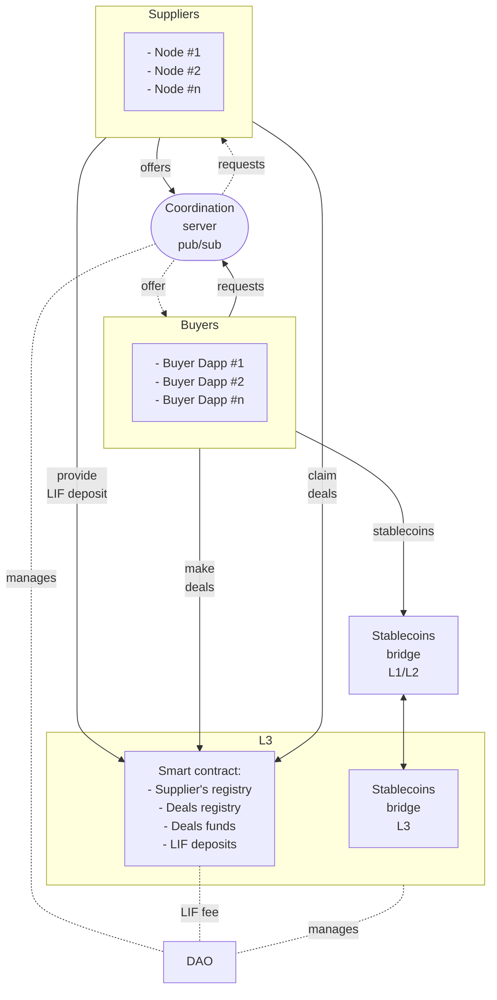

# The WindingTree Market Protocol

The WindingTree market protocol is an extendable decentralized platform that aims to disrupt the traditional travel industry by eliminating intermediaries and increasing coordination between service providers and consumers.

By leveraging blockchain technology, the protocol allows for a transparent and secure marketplace where travelers can connect directly with service providers (suppliers), such as airlines, hotels, and tour operators, without the need for intermediaries like online travel agencies (OTAs).

This not only reduces costs for consumers but also increases profits for service providers, who can now access a larger customer base and have more control over their pricing and offerings. The protocol also enables more efficient and reliable coordination between service providers and their customers, reducing the risk of overbooking and improving the overall travel experience for consumers.

With its innovative approach to the travel industry, the WindingTree market protocol has the potential to revolutionize the way people plan and book their travel arrangements.

## Overview

### The protocol structure

## L3 network

The main idea that stays in the foundation of scalability of the deals and the protocol financial management is a customizable and trustless EVM-compatible blockchain. The expected performance increase of this solution is 10-100X in comparison to known L2 solutions. We plan to use the LIF as a native token in this network which will open its potential and expand the range of use cases.

Tight collaboration with zkSync, one of the leading providers of Ethereum scalability solutions inspires us to succeed. In Q3 2023 we plan to integrate zkSync's HyperChain solution as L3 of the protocol.

From the network customer point of view working with L3 will be the same as with L1/L2 and developer experience as well. The protocol SDK will provide developers with all the required tools ad interfaces.

## Coordination server

This is a centralized pubsub server dedicated to dynamic coordination between buyers and suppliers. This server is built on top of the [`libp2p`](https://github.com/libp2p/js-libp2p) library and implements a fast and secure peer-to-peer messaging protocol.

Using this server buyers are able to broadcast requests and suppliers can catch these requests on the basis of contextual subscriptions. In the response to these requests, suppliers generate deal offers and its turn transfer them to buyers. Communication through the coordination server is fast and can be scalable in many ways.

The format of messages is standardized by the protocol but easily extendable with the help of SDK.

## Clients

The protocol `clients` are the clients of the coordination server equipped with the all required tools for the creation, validation and publishing of requests and catching incoming offers. These clients can be started in the browser or electron.js (mobile) environment.

## Supplier nodes

Suppliers nodes are much more featured `clients` of the coordination server but also cover a wide range of specific supplier use cases. These nodes can catch incoming requests and build signed (verifiable) offers. Also, they have tools that allow them to connect external resources such as databases or content provider API.

## Smart contract

Smart contract is the decentralized component of the protocol that is used by parties for the finalization of deals and funds management. The smart contract consists of the following main modules:

- suppliers registry
- deals registry
- deal funds management
- LIF deposits management

When the client gets an offer from the supplier to make a deal it must send a transaction to the smart contract using the `offer` as an argument. The logic of the contract allows for checking the validity of the `offer` and implementing its conditions in the deal.

## LIF tokenomics

Please follow this [link](https://github.com/windingtree/protocol-tokenomics) to get more about the protocol LIF tokenomics.

## DAO

The WindingTree Market protocol DAO is the exclusive protocol rules, tools and services holder and manager. DAO will:

- participate in the protocol L3 network as a validator and collect fees from transactions (gas fee)
- own the smart contract of the protocol and manages its parameters, approve upgrades, etc
- manages the protocol URIs (the coordination server, bridges, etc) via the smart contract
- collects the protocol fee from suppliers
- approve the protocol change proposals via voting
- invests own treasure funds in the protocol infrastructure projects, tools, etc
