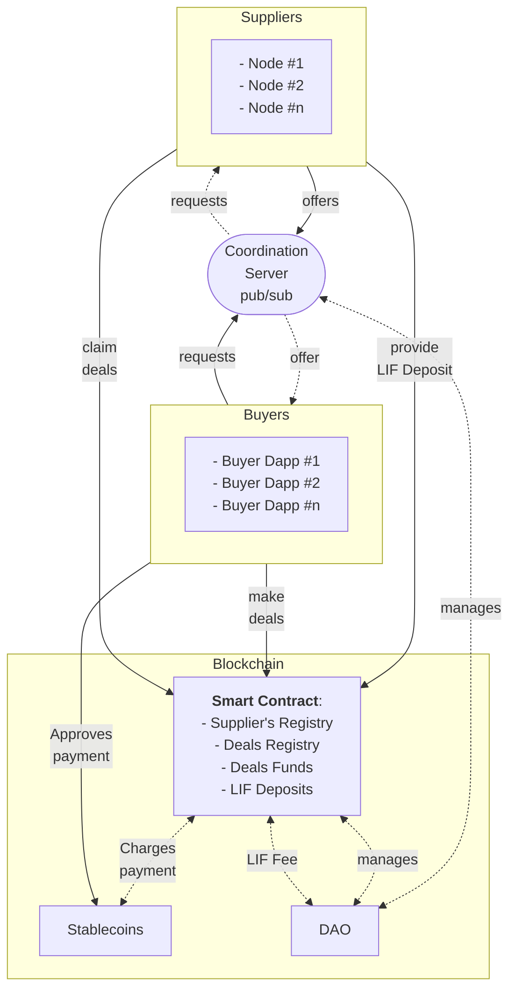

# The WindingTree Market Protocol

The WindingTree market protocol aims to revolutionize the travel industry by eliminating intermediaries, fostering direct coordination between service providers and consumers. This decentralized platform, powered by blockchain technology, creates a transparent and secure marketplace. It seamlessly connects travelers with suppliers such as airlines, hotels, and tour operators, reducing the need for online travel agencies (OTAs).

The protocol offers dual benefits: cost reduction for consumers and increased profits for suppliers. With access to a broader customer base and better control over pricing and offerings, suppliers can thrive. Simultaneously, consumers enjoy improved coordination and reliability, minimizing risks like overbooking and enhancing their overall travel experience.

Embrace the WindingTree market protocol to transform how travel arrangements are planned and booked, delivering a more efficient and rewarding experience for everyone involved.

## Overview

### The Protocol Structure

This diagram illustrates the architecture of the WindingTree Market Protocol ecosystem, highlighting the roles of the DAO (Decentralized Autonomous Organization), Coordination Server, and blockchain in governance, request-offer coordination, and financial transactions, respectively.

## Scalability

The scalability cornerstone within the protocol for deals and financial management is a customizable and trustless EVM-compatible blockchain, referred to as the L3 network. Planned for the later stages of protocol evolution, this innovative solution is expected to deliver a performance increase of 10-100X compared to existing solutions. The LIF token will serve as the native token in this network, leveraging its full potential and expanding the range of use cases.

For both network customers and developers, interacting with the L3 network will be seamless, akin to working with Layer 1 (L1). The protocol SDK will equip developers with all necessary tools and interfaces, ensuring a smooth and familiar experience.

> **Note**: Currently, the protocol SDK does not offer any specific functionality dedicated to L3-related interactions. Our focus at this stage of development has been on implementing and refining general protocol features. However, we are actively working on incorporating L3-related features, scheduled for release later.

## Coordination Server

The Coordination Server, a centralized pubsub server built atop the [`libp2p`](https://github.com/libp2p/js-libp2p) library, is dedicated to dynamic coordination between buyers and suppliers. It implements a fast and secure peer-to-peer messaging protocol, allowing buyers to broadcast requests and suppliers to respond with offers based on contextual subscriptions.

## Clients

Protocol `clients` refer to the coordination server's clients, equipped with all necessary tools for creating, validating, and publishing requests, as well as catching incoming offers. These clients offer a user-friendly interface and essential functionalities for smooth communication within the protocol ecosystem.

Clients can operate in various environments, including web browsers, electron.js for mobile applications, and node.js for server-side applications. This flexibility ensures the protocol's accessibility and convenience across different platforms.

## Supplier Nodes

Supplier nodes are advanced versions of the `clients` that cater to specific supplier use cases. They possess additional features and functionalities, enabling them to effectively participate in the protocol ecosystem. These nodes have the capability to catch incoming requests from buyers and generate signed and verifiable offers in response. Additionally, they can connect to external resources, enhancing their offerings to buyers.

## Smart Contracts

Smart contracts play a crucial role in finalizing deals and managing funds in a trustless manner. They comprise several main modules, each serving a specific function within the protocol ecosystem, including protocol configuration, suppliers registry, deals registry, LIF deposits management, and protocol tokenomics. These contracts ensure a fair and enforceable agreement between parties.

## DAO (Decentralized Autonomous Organization)

The WindingTree Market Protocol DAO oversees the protocol's rules, tools, and services, playing a pivotal role in its operation and development. It participates in the L3 network as a validator, manages smart contracts, collects protocol fees, and invests in infrastructure projects

. This decentralized governing entity promotes long-term sustainability and alignment with stakeholders' interests.

> **Note**: The implementation of the WindingTree Market Protocol DAO is under active discussion and planned for a future release.
