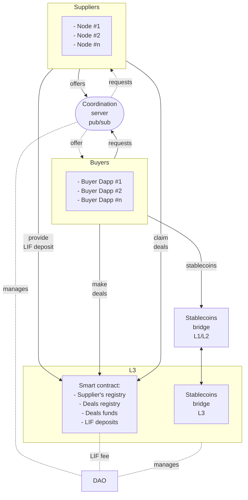

# The WindingTree Market Protocol

The WindingTree market protocol revolutionizes the travel industry by eliminating intermediaries and fostering direct coordination between service providers and consumers.

Powered by blockchain technology, this decentralized platform creates a transparent and secure marketplace, seamlessly connecting travelers with suppliers like airlines, hotels, and tour operators, without the need for online travel agencies (OTAs).

The protocol offers dual benefits: cost reduction for consumers and increased profits for suppliers. With access to a broader customer base and better control over pricing and offerings, suppliers thrive, while consumers enjoy improved coordination and reliability, minimizing risks like overbooking and enhancing their overall travel experience.

Embrace the WindingTree market protocol to transform how travel arrangements are planned and booked, delivering a more efficient and rewarding experience for everyone involved.

## Overview

### The protocol structure

The diagram illustrates the architecture of the WindingTree Market Protocol ecosystem:

- The DAO (Decentralized Autonomous Organization) manages the ecosystem's governance.
- Buyers interact with the Coordination Server (pub/sub) to send requests and receive offers.
- Suppliers (Nodes) respond to requests from the Coordination Server by making offers.
- The Stablecoins bridge facilitates transferring Stablecoins between Layer 1 (L1) and Layer 2 (L2) of the blockchain.
- The L3 layer contains Smart Contracts for Supplier's Registry, Deals Registry, Deals Funds management, and LIF (protocol token) deposits.
- Suppliers provide LIF deposits to the Smart Contract, and Buyers can make deals with Suppliers through the same Smart Contract.
- Nodes (Suppliers) claim deals from the Smart Contract after they are finalized.

The DAO manages the Coordination Server, L3 layer, and LIF fees associated with the protocol.

## L3 Network

The cornerstone of scalability for deals and financial management within the protocol is a customizable and trustless EVM-compatible blockchain, referred to as the L3 network. This innovative solution is expected to deliver a performance increase of 10-100X compared to known Layer 2 (L2) solutions. To leverage the full potential and expand the range of use cases, the LIF token will serve as the native token in this network.

For both network customers and developers, interacting with the L3 network will be seamless, akin to working with Layer 1 (L1) or Layer 2 (L2). The protocol SDK will equip developers with all the necessary tools and interfaces, ensuring a smooth and familiar developer experience.

> **Note**: Currently, the protocol SDK does not offer any specific functionality dedicated to L3-related interactions. During this stage of development, our focus has been on implementing and refining the general protocol features. However, we are actively working on incorporating L3-related features, and they are scheduled for release later this year.

## Coordination Server

The Coordination Server is a centralized pubsub server dedicated to dynamic coordination between buyers and suppliers. This server is built on top of the [`libp2p`](https://github.com/libp2p/js-libp2p) library and implements a fast and secure peer-to-peer messaging protocol.

Using this server, buyers can broadcast requests, and suppliers can catch these requests based on contextual subscriptions. In response to these requests, suppliers generate deal offers and transfer them back to buyers. Communication through the coordination server is fast and can be scalable in various ways.

The format of messages is standardized by the protocol but easily extendable with the help of SDK.

## Clients

The protocol `clients` refer to the clients of the coordination server, equipped with all the necessary tools for creating, validating, and publishing requests, as well as catching incoming offers. These clients offer a user-friendly interface and essential functionalities for smooth communication within the protocol ecosystem.

Clients can be started in various environments, including web browsers, electron.js for mobile applications, and node.js for server-side applications. This flexibility enables users to access the protocol's features through different platforms, making it more accessible and convenient.

## Supplier Nodes

Supplier nodes are advanced versions of the `clients` that connect to the coordination server and cater to specific supplier use cases. These nodes possess additional features and functionalities, enabling them to effectively participate in the protocol ecosystem.

Supplier nodes have the capability to catch incoming requests from buyers through the coordination server. They can then generate signed and verifiable offers in response to these requests. This ensures a secure and reliable exchange of offers between suppliers and buyers.

In addition to their coordination capabilities, supplier nodes are equipped with tools that enable them to connect to external resources such as databases or content provider APIs. This connectivity enhances their ability to access and utilize external data and services, further enriching their offerings to buyers.

Supplier nodes play a vital role in expanding the protocol's reach and enabling a diverse range of suppliers to participate seamlessly in the decentralized marketplace.

## Smart Contracts

Smart contracts form a decentralized component of the protocol and play a crucial role in finalizing deals and managing funds in a trustless manner. These contracts comprise several main modules, each serving a specific function within the protocol ecosystem:

- `Protocol Configuration`: This module handles the configuration and settings of the entire protocol, ensuring its smooth operation.

- `Suppliers Registry`: The suppliers registry module maintains a record of registered suppliers (entities) within the protocol and manages the state of records.

- `Deals Registry`: The deals registry module serves as a ledger for all finalized deals, ensuring transparency and accountability in deal management.

- `LIF Deposits Management`: The LIF deposits management module oversees the management of LIF token deposits, supporting the protocol's native token.

- `Protocol Tokenomics`: This module encompasses the tokenomics of the protocol, ensuring a well-balanced and sustainable economic model.

When a client receives an offer from a supplier to make a deal, it must initiate a transaction to the smart contract, providing the `offer` as an argument. The contract's logic validates the `offer` and implements its conditions in the deal, ensuring a fair and enforceable agreement.

The use of smart contracts enhances the security and trustworthiness of deal finalization, as all interactions are executed according to predefined and transparent rules established within the contract's logic.

## DAO (Decentralized Autonomous Organization)

The WindingTree Market Protocol DAO serves as the authoritative holder and manager of the protocol's rules, tools, and services. The DAO plays a pivotal role in overseeing various aspects of the protocol's operation and development:

1. **Participation in the Protocol L3 Network:** The DAO actively participates in the protocol's L3 network as a validator and collects fees from transactions (gas fees) to support the network's operations.

2. **Ownership and Management of Smart Contracts:** The DAO owns and manages the smart contract that governs the protocol. It has the authority to adjust parameters, approve upgrades, and perform other essential functions to ensure the smart contract's efficient operation.

3. **Management of Protocol URIs:** The DAO is responsible for managing the protocol's Uniform Resource Identifiers (URIs), including those of the coordination server, bridges, and other critical components, via the smart contract.

4. **Collection of Protocol Fees:** The DAO collects fees from suppliers who participate in the protocol, contributing to the sustainability and growth of the ecosystem.

5. **Approval of Protocol Changes:** The DAO plays a key role in the governance of the protocol by approving or rejecting proposed changes through a voting process. This ensures that any modifications to the protocol align with the community's consensus.

6. **Investment in Protocol Infrastructure:** The DAO invests its treasury funds strategically in projects and tools that enhance the protocol's infrastructure and capabilities.

By functioning as a decentralized governing entity, the DAO ensures a transparent, community-driven approach to the management and development of the WindingTree Market Protocol, promoting long-term sustainability and alignment with the interests of its stakeholders.

> **Note**: The WindingTree Market Protocol DAO is not yet implemented. Its role and functionality are currently under active discussions, and the DAO implementation is planned for one of a future releases.
